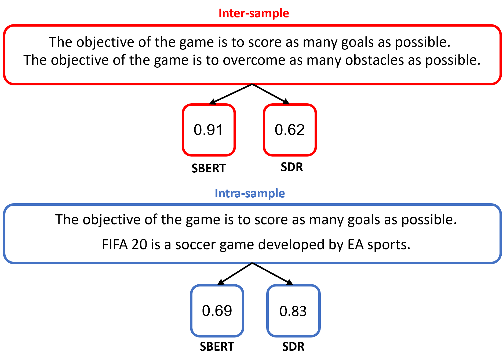
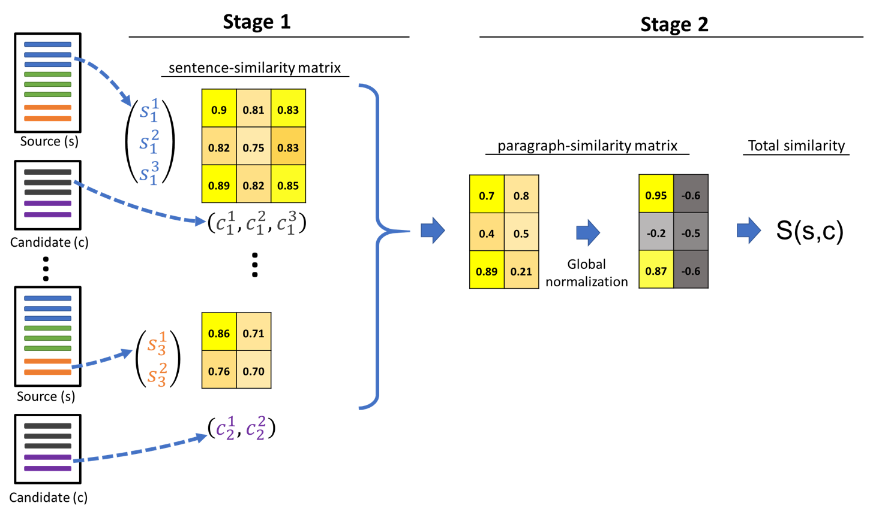
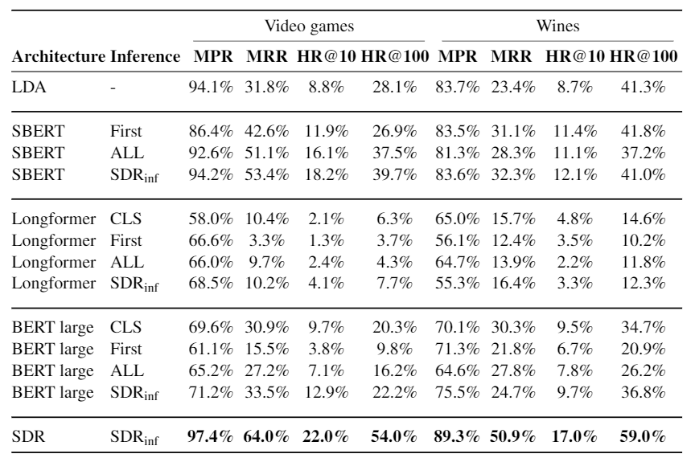

# Self-Supervised Document Similarity Ranking (SDR) via Contextualized Language Models and Hierarchical Inference

This repo is the implementation for [**SDR**](https://arxiv.org/abs/2106.01186). 


&nbsp;
<p align="center">
    
</p>


## Tested environment
- Python 3.7
- PyTorch 1.7
- CUDA 11.0
  
Lower CUDA and PyTorch versions should work as well.

&nbsp;
## Contents
- [Installation](#installation)
- [Datasets](#datasets)
- [Train with our datasets](#training)
- [Hierarchical Inference](#inference)
- [Cite](#cite)

License, Security, support and code of conduct specifications are under the `Instructions` directory.
&nbsp;
## Installation
Run
```
bash instructions/installation.sh 
```
&nbsp;

## Datasets
The published datasets are:
* Video games
  * 21,935 articles
  * Expert annotated test set. 90 articles with 12 ground-truth recommendations.
  * Examples:
    * Grand Theft Auto - Mafia
    * Burnout Paradise - Forza Horizon 3
* Wines
  * 1635 articles
  *  Crafted by a human sommelier, 92 articles with ~10 ground-truth recommendations.
  *  Examples:
     *  Pinot Meunier - Chardonnay
     *  Dom Pérignon - Moët & Chandon

For more details and direct download see [Wines](https://zenodo.org/record/4812960#.YK8zqagzaUk) and [Video Games](https://zenodo.org/record/4812962#.YK8zqqgzaUk).

&nbsp;

# Training
**The training process downloads the datasets automatically.**

``` 
python sdr_main.py --dataset_name video_games
```
The code is based on [PyTorch-Lightning](https://pytorch-lightning.readthedocs.io/en/latest/), all PL [hyperparameters](https://pytorch-lightning.readthedocs.io/en/latest/common/trainer.html) are supported. (`limit_train/val/test_batches, check_val_every_n_epoch` etc.)

## Tensorboard support
All metrics are being logged automatically and stored in
```
SDR/output/document_similarity/SDR/arch_SDR/dataset_name_<dataset>/<time_of_run>
```
Run `tesnroboard --logdir=<path>` to see the the logs.

&nbsp;

# Inference
The hierarchical inference described in the paper is implemented as a stand-alone service and can be used with any backbone algorithm (`models/reco/hierarchical_reco.py`).
<p align="center">
    
</p>

&nbsp;


```
python sdr_main.py --dataset_name <name> --resume_from_checkpoint <checkpoint> --test_only
``` 

# Results
<p align="center">
    
</p>

# Citing & Authors
If you find this repository or the annotated datasets helpful, feel free to cite our publication -

 SDR: Self-Supervised Document-to-Document Similarity Ranking viaContextualized Language Models and Hierarchical Inference
 ```
  @misc{ginzburg2021selfsupervised,
      title={Self-Supervised Document Similarity Ranking via Contextualized Language Models and Hierarchical Inference}, 
      author={Dvir Ginzburg and Itzik Malkiel and Oren Barkan and Avi Caciularu and Noam Koenigstein},
      year={2021},
      eprint={2106.01186},
      archivePrefix={arXiv},
      primaryClass={cs.CL}
}
 ```

Contact: [Dvir Ginzburg](mailto:dvirginz@gmail.com), [Itzik Malkiel](mailto:itzik.malkiel@microsoft.com).
